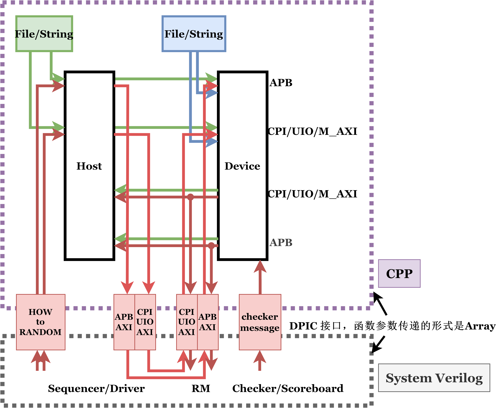

# cpp model

- **蓝色**是 Device 对一个 File 输入的验证
- **绿色**是 Host + Device 对一个 File 输入的验证
- **红色**是 SV + CPP 环境下的总体验证

## 一、可能需要修改的
- **APB** 接口 可能会被 **共享变量池** 取代
- DUT 还有的 **DOE CPI-global CPI-credit** 等接口 暂定不在 **cpp model** 中验证

## 二、Device
见 [device/device.md](device/device.md)

## 三、Host