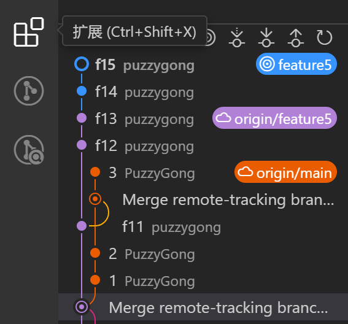

# git 协作开发

> 确保工程在 ***BUPT Environment*** 环境下

## 一、总体说明
如下图，插件 GitLens 提供 git 的可视化 <br>


  - **橙色** 的分支是 **origin/main**
  - **蓝色** 的分支是 **feature_XXX**
  - **紫色** 的分支是 **origin/feature_XXX**
  - **其他颜色** 代表 merge 过程

此工程中：
- 每个协作者使用 **1** 台主机
- 每台主机注册 **1** 个 gitea 账号
- 每个 gitea 账号使用 **1** 个分支进行代码编写

## 二、协作者指南


### 2.1 创建分支

- **拉取工程（git clone）**
  ```
  git clone https://git.bricknas.top/PuzzyGong/CXL3.x_Type3_HDM
  ```

- **用 vscode 打开新出现的文件夹**
- **创建分支（git checkout -b）** ：vscode最左边竖向的栏中 → 源代码管理 → 更改 → "更改"右侧的"更多操作" → 分支 → 创建分支

### 2.2 代码编写
- **编写代码，ctrl+s保存所有修改**
- **提交（git commit）** ：vscode最左边竖向的栏中 → 源代码管理 → 更改 → "更改"下方的"消息" → "消息"下方的"√ 提交" → 点击"是"暂存所有更改并直接提交 <br>

- **推送（git push）** ：vscode最左边竖向的栏中 → 源代码管理 → "更改"下方的"同步更改 N 个" → 第一次报错就再点击一次"同步更改 N 个"

### 2.3 请求合并

- **抓取（git fetch）** ：vscode最左边竖向的栏中 → 源代码管理 → 更改 → "更改"右侧的"更多操作" → 抓取

- **合并（git merge）** ：vscode最左边竖向的栏中 → 源代码管理 → 更改 → "更改"右侧的"更多操作" → 合并 → origin/main<br>

- 如果有冲突，联系仓库所有者
- 如果没有冲突或解决冲突后，再**推送**一次，联系仓库所有者将该分支合并入 main

### 2.4 版本回退
如果要进行版本回退。最好新建一个分支，然后在该分支上进行回退操作。

## 三、仓库所有者指南

> 在远程将 main 设置为保护分支，规则中的所有白名单设置为仅仓库所有者

> 确保本地存在协作者的若干个分支

> 直接在 vscode 上进行 merge


 
